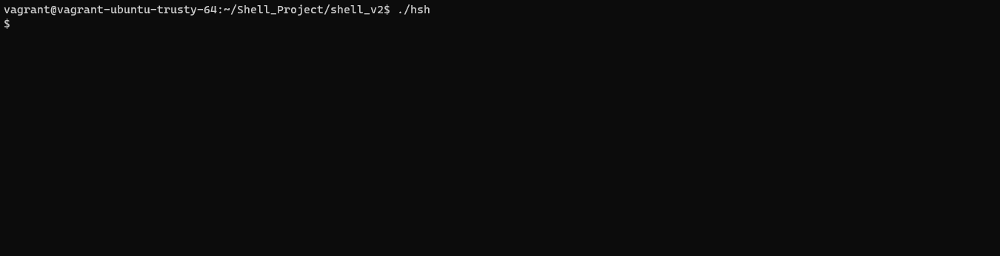

[](https://GitHub.com/Naereen/StrapDown.js/graphs/commit-activity) [](http://lbesson.bitbucket.org/) [](https://lbesson.mit-license.org/) [](https://github.com/Naereen/badges)  [](https://GitHub.com/Naereen/)
<p align="center">
  
</p>

#  Twitter clone challenge

> **(Read tweets from other people.)**

Twitter clone challenge is a rails app that allows you to write tweets and read tweets from the people you follow.

<p style="font-size:25px; font-weight:bold"> 

</p>
</center>

This project allows users to create an account, customize it and start creating tweets, at the same time you can follow other users with interesting content to be able to only see their content.

### Team 🎮

 [David Orejuela](https://github.com/daorejuela1) <br>  Software Developer|
| -------------- |
 
| <a href="https://twitter.com/DavidOrejuela14" ></a> &nbsp;<a href="https://www.linkedin.com/in/davidorejuela14/" ></a> <a href="https://medium.com/@daorejuela1" ></a>|

## Motivation 🏋

This software is a 1-week challenge created to test our technical knowledge using Ruby on Rails.

## Main logic 🧠

If we are not logged into the app then we can see all the most recent tweets from all the users and have the option to log in or sign up:


 1. You can sign in with the username or E-mail
 
 2. You can sign up to create a new account


 [Complete image to explore](https://share.balsamiq.com/c/mUBDKnkNjrHnvLKN38xc1k.png)
 	
Once you are signed in, you can modify your profile, create a new tweet, check the profile of who you are following or who is following you, search a new user to follow/unfollow, see your tweets in your home page or see the tweets from all who you are following in the main page.
 

## Code style 👓


Rubocop ☞ [](https://github.com/rubocop/rubocop)

## Demo📷
<center>

## Seeing my tweets
<p style="font-size:25px; font-weight:bold"> 

</p>

--------------

## Following another user
<p style="font-size:25px; font-weight:bold">

</p>

--------------
## Seeing my followers
<p style="font-size:25px; font-weight:bold">

</p>


## Tech used 🛠


Twitter clone was created using Ruby on Rails, additionals gems used to simplify the logic were used: 

 
| Gem  | Utility |
|----------------------------------------|--|
|  Devise                                       | Simplifies user handling logic |
|  image_processing| Allows image modification with ruby |
|  will_paginate | Simplifies loading objects into the view with a pagination logic |
 

## Requirements 📚

- Ubuntu 18.04+
- Ruby 2.7+
- Rails 6+
- Postgres 1.8+

## Installation & Init 📖

Make sure that the following env variables are defined

| Env variable name| Meaning|
|----------------------------------------|--|
|  TWITTERCLONE_DATABASE_USER| Postgres valid username |
|  TWITTERCLONE_DATABASE_PASSWORD| Postgres valid password|


Please make sure that you have installed the essentials and rails 6+ before cloning:

```
sudo yum install -y git-core zlib zlib-devel gcc-c++ patch readline readline-devel libyaml-devel libffi-devel openssl-devel make bzip2 autoconf automake libtool bison curl sqlite-devel
```

```
git clone https://github.com/ImageMagick/ImageMagick.git ImageMagick-7.0.11
cd ImageMagick-7.0.11
./configure
make
```

1. Clone the repository: `git clone https://github.com/daorejuela1/twitter_clone`
2. Go to the folder: `cd twitter_clone`
3. Install requirements `bundle`
4. Create the data base `rails db:create`
5. Run the migrations `rails db:migrate`
6. Run the server: `rails s -b 0.0.0.0 -p 3000`

## Usage 💪

Get into the URL `127.0.0.1:3000` to start the web app, create a new account, go into your @username at the top of the web pages and start writing.

When you log out you can see all the recent tweets from all the users using the system

## Features 📜
 
 ### Tweet
 

 - This software will allow you to tweet messages

### Follow/Unfollow

 - This software will allow you to follow/unfollow other users to see their tweets on your Feeds


## Live 🧍


To check the live software clic [here](https://twitter-clone-daorejuela1.herokuapp.com/) (Uploaded images will dissapear after sometime)

## Related projects 💼

Here are some awesome projects I have been working on:

|[Mastermind Hackday Project](https://github.com/daorejuela1/mastermind)| [Daily tweet](https://github.com/daorejuela1/daily_tweet) | [Monty bytecode decoder](https://github.com/daorejuela1/monty) | [Serpent Algorithm](https://github.com/daorejuela1/serpent) | [Custom Shell v2](https://github.com/daorejuela1/shell_v2)
|--|--|--|--|--|
|  |  |  |  |  |

## Credits ✈

Special thanks to [koombea.com](https://www.koombea.com/) for letting me be part of this awesome challenge.
